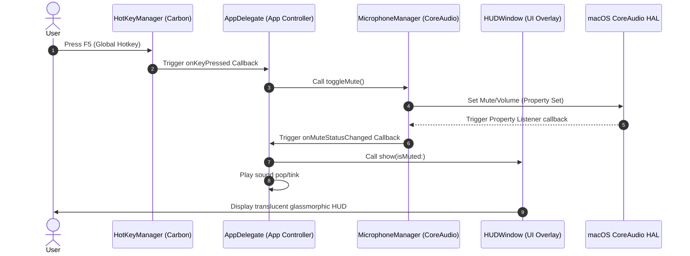

# 🎙️ QuickMute

<p align="center">
  <strong>A lightweight, zero-permission global F5 microphone mute utility for macOS.</strong>
</p>

<p align="center">
  
  
  
  
  
</p>

---

## 📖 Table of Contents
- [About the Project](#-about-the-project)
- [Key Features](#-key-features)
- [Architecture & Flow](#-architecture--flow)
- [Project Structure](#-project-structure)
- [Installation](#-installation)
  - [Pre-compiled DMG](#1-pre-compiled-dmg)
  - [Building from Source](#2-building-from-source)
- [Usage & Keyboard Mappings](#-usage--keyboard-mappings)
- [Troubleshooting](#-troubleshooting)
- [Production Versioning](#-production-versioning)
- [Contributing](#-contributing)
- [License](#-license)

---

## 🎙️ About the Project

**QuickMute** is a high-performance utility designed to toggle your macOS system microphone with a single press of the **F5** key. 

Unlike other software that attempts to mute individual video-conferencing apps (which is prone to failure and breaking updates), QuickMute operates at the **macOS CoreAudio Hardware Abstraction Layer (HAL)**. Toggling mute in QuickMute instantly silences the system's default input microphone, guaranteeing 100% silent audio across **all applications**—including **FaceTime, WhatsApp, Zoom, Slack, Microsoft Teams, Discord, Google Meet, Webex**, and browser-based recording sessions.

---

## ✨ Key Features

*   **🔒 Zero-Permission Interception**: Leverages the macOS Carbon Event Manager to capture the F5 key globally. It works when the app is in the background **without requiring intrusive Accessibility (Assistive Device) permissions**.
*   **🛠️ CoreAudio Integration**: Operates directly on the default audio input device. Fallback mechanics automatically adjust the volume scalar to `0.0` for devices that do not support standard hardware mute properties.
*   **🔄 Dynamic Device Sync**: Listens to system audio hardware events. If you plug in a USB microphone, switch to AirPods, or unplug a headset, QuickMute immediately redirects its observers and syncs the mute state.
*   **✨ Premium Glassmorphic HUD**: Displays a translucent status overlay centered on the primary display (matching native macOS volume HUD aesthetics). Built using `NSVisualEffectView` with `.hudWindow` material.
*   **🔊 Audio Feedback**: Plays a subtle system `Pop` sound on mute and a `Tink` sound on unmute.
*   **🚀 Modern Boot Agent**: Uses modern `ServiceManagement` APIs (`SMAppService`) to configure auto-start on login.

---

## 📐 Architecture & Flow

The interaction logic and coordination among the Swift modules:



---

## 📂 Project Structure

```
QuickMute/
├── main.swift              # Application entry point, disables stdout buffering.
├── AppDelegate.swift       # Orchestrates settings, sound play, login service, and menus.
├── MicrophoneManager.swift # Interfaces with CoreAudio (HAL) to toggle/monitor mute state.
├── HotKeyManager.swift     # Registers the global F5 hotkey hook using Carbon APIs.
├── HUDWindow.swift         # Renders the native glassmorphic HUD status display panel.
├── Info.plist              # Background agent properties and microphone descriptions.
├── AppIcon.icns            # Compiled macOS multi-resolution App Icon asset.
├── quickmute_logo.jpg      # Source high-resolution app logo image.
├── quickmute_logo_transparent.png # Processed transparent app logo.
├── build.sh                # Compilation script assembling QuickMute.app.
├── release.sh              # Production packaging script producing .dmg and .zip bundles.
├── generate_icns.sh        # Utility script generating AppIcon.icns from logo source.
├── crop_icon.swift         # Swift script to crop and add transparency to the logo.
└── README.md               # Repository documentation.
```

---

## 📦 Installation

### 1. Pre-compiled DMG
To install the packaged build:
1. Double-click the generated `QuickMute.dmg`.
2. Drag **QuickMute.app** into your `/Applications` directory.
3. Open it from your Applications folder (approve microphone permissions if prompted).

### 2. Building from Source
Ensure you have Xcode Command Line Tools installed (`xcode-select --install`).
```bash
# Clone the repository
git clone https://github.com/yourusername/QuickMute.git
cd QuickMute

# Compile and package the app bundle
./build.sh

# Run the compiled app bundle in the background
open QuickMute.app
```

---

## ⌨️ Usage & Keyboard Mappings

By default, macOS configures the top row of keyboard keys (F1–F12) to control hardware media functions (such as display brightness, keyboard backlighting, or dictation).

Because **F5** is mapped by macOS to **Dictation** or **Keyboard Backlight Down**:
1.  **Default Option**: You must press **`Fn + F5`** (hold down the `fn` / Globe key and press F5) to toggle your microphone.
2.  **F5 Direct Press Option**: If you want to mute by pressing **F5** directly (without the `fn` key):
    *   Navigate to **System Settings** > **Keyboard** > **Keyboard Shortcuts** > **Function Keys**.
    *   Turn on **"Use F1, F2, etc. keys as standard function keys"**.

---

## 🔍 Troubleshooting

#### 1. Pressing F5 does not mute the mic
*   *Cause*: Your keyboard is emitting a media key event instead of standard F5.
*   *Solution*: Press **`Fn + F5`**, or enable "Use F1, F2, etc. keys as standard function keys" in your macOS Keyboard Settings.

#### 2. The menu bar icon displays status, but other apps still capture audio
*   *Cause*: The application might be using a non-default audio input device that was bypassed, or microphone permission was denied.
*   *Solution*: Ensure the communication app's input settings are configured to use the **"System Default"** input device, and verify that QuickMute is authorized under **System Settings > Privacy & Security > Microphone**.

---

## 🏷️ Production Versioning

QuickMute handles versioning inside `Info.plist` dynamically using the native macOS `plutil` utility:

*   **Marketing Version (`CFBundleShortVersionString`)**: e.g., `1.0.0` (Semantic Version).
*   **Build Version (`CFBundleVersion`)**: e.g., `42` (Auto-incrementing compilation index).

To inject production-ready version markers during packaging:
```bash
# Syntax: ./release.sh <marketing_version> <build_number>
./release.sh 1.1.0 42
```
This updates the build headers and bundles the build into `QuickMute.dmg` and `QuickMute.zip`.

---

## 🤝 Contributing

Contributions are welcome! Please follow these guidelines:
1. Fork the repository.
2. Create your feature branch (`git checkout -b feature/AmazingFeature`).
3. Commit your changes (`git commit -m 'Add some AmazingFeature'`).
4. Push to the branch (`git push origin feature/AmazingFeature`).
5. Open a Pull Request.

---

## 📄 License

This project is licensed under the MIT License - see the [LICENSE](LICENSE) file for details.
